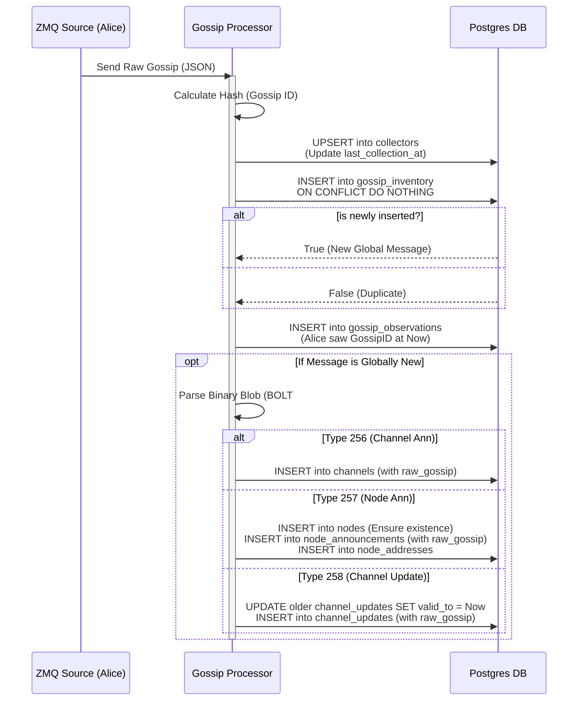

# Gossip Processor

  

The **Gossip Processor** is the central ingestion engine of the `ln-history` platform. It subscribes to multiple ZeroMQ `PUB` sockets (from Core Lightning nodes), deduplicates incoming gossip messages in real-time, and persists them into a PostgreSQL database.

## Architecture

The service operates on a **Linear Pipeline** model:
`ZMQ Source` $\rightarrow$ `Deduplication` $\rightarrow$ `Observation Logging` $\rightarrow$ `Parsing` $\rightarrow$ `Persistence`.

### Key Features
* **Multi-Source Ingestion:** Consumes gossip from multiple nodes (Alice, Bob) simultaneously.
* **Global Deduplication:** Uses a lightweight "Master Inventory" table to ensure we only process unique messages once.
* **Provenance Tracking:** Records exactly *which* collector saw *which* message and *when* (N:M relationship).
* **Snapshot Optimized:** Raw gossip payloads are stored directly in their respective content tables (`channels`, `updates`, `node_announcements`) with Validity Ranges (SCD Type 2), allowing for join-free snapshot queries.

---

## Database Schema

The processor writes to two main categories of tables: **Statistics** (Observation Data) and **Content** (The Gossip Payloads).

### 1. Statistics & Observations
These tables answer the question: *"Who saw what, and when?"*

| Table | Description | Key Columns |
| :--- | :--- | :--- |
| **`collectors`** | Metadata about our infrastructure nodes (Alice, Bob). Tracks performance metrics. | `node_id`, `last_collection_at`, `total_messages_collected` |
| **`gossip_inventory`** | The global registry of all unique gossip hashes. Acts as the "Gatekeeper" for deduplication. | `gossip_id` (PK), `type`, `first_seen_at` |
| **`gossip_observations`** | The N:M link table. Stores the proof that a specific collector saw a specific hash. | `gossip_id`, `collector_node_id`, `seen_at` |

### 2. Persisting Gossip Messages (Content)
These tables store the parsed BOLT #7 data **and** the raw binary blob. They use **SCD Type 2** (Validity Ranges) to preserve history.

| Table | Description | Key Columns |
| :--- | :--- | :--- |
| **`nodes`** | Minimal record of public node existence. | `node_id`, `first_seen`, `last_seen` |
| **`node_announcements`** | Stores node metadata and the **raw node announcement blob**. | `gossip_id`, `alias`, `raw_gossip`, `valid_from`, `valid_to` |
| **`channels`** | Stores static channel definitions and the **raw channel announcement blob**. | `scid`, `source_node_id`, `target_node_id`, `raw_gossip` |
| **`channel_updates`** | Stores dynamic routing fees and the **raw channel update blob**. | `scid`, `direction`, `fee_base_msat`, `raw_gossip`, `valid_from`, `valid_to` |
| **`node_addresses`** | Normalized table for IP/Tor addresses linked to announcements. | `gossip_id`, `type_id`, `address`, `port` |

---

## Control Flow

The following diagram illustrates the exact lifecycle of an incoming gossip message.


    
## Detailed Logic by Message Type
1. Channel Announcement (type: `256`)

    **Trigger**: Received a channel_announcement.

    **Action**:
    - Parse the message to extract short_channel_id (`scid`), `node_id_1`, and `node_id_2`.
    - Ensure both `node_id_1` and `node_id_2` exist in the `nodes` table (INSERT IGNORE).
    - Insert the row into the `channels` table.
    - Note: Chain data (Funding Block, Capacity) is not in the gossip message. This field is left NULL to be filled by the separate chain-enricher service later.

2. Node Announcement (type: `257`)

    **Trigger**: Received a node_announcement.

    **Action**:
    - Parse the message to extract `alias`, `color`, and `addresses`.
    - **SCD Logic**: Find the previous announcement for this `node_id` where `valid_to IS NULL`.
    - Update the previous row: set `valid_to` = `current_timestamp`.
    - Insert the new row into `node_announcements` with `valid_from` = `current_timestamp` and `valid_to` = `NULL`.
    - Address Normalization: Iterate through the `addresses` (`IPv4`, `Tor`, etc.) and insert them into the `node_addresses` table, linking them to this specific `gossip_id`.

3. Channel Update (type: `258`)

    **Trigger**: Received a channel_update (Fee change, disable/enable).

    **Action**: 
    - Parse the message to extract `scid`, `direction`, and `fee policies`.
    - Validation: Check if the `scid` exists in the `channels` table.
        - If Yes: Proceed.
        - If No: Insert anyway (Orphan Update). This is common in gossip; the announcement might arrive later.
    - **SCD Logic**: Find the previous active update for this (`scid`, `direction`) tuple.
    - Update the previous row: `set valid_to = current_timestamp`.
    - Insert the new row into `channel_updates` with `valid_from` = `current_timestamp`.

## Monitoring & Metrics

The service exposes real-time metrics via a Prometheus endpoint (default port `8000`) for Grafana visualization. 
These metrics provide visibility into both the **operational health** of the processor and the **behavior of the Lightning Network**.

| Metric Name | Type | Labels | Description |
| :--- | :--- | :--- | :--- |
| `gossip_messages_total` | Counter | `type`, `source` | Total raw messages received from all sources (internal & external). |
| `gossip_unique_total` | Counter | `type` | Count of **globally new** messages (First time seen by the database). |
| `gossip_duplicates_total` | Counter | `type`, `source` | Count of messages that were already known (Redundant gossip). |
| `gossip_processing_lag_seconds` | Histogram | None | Latency between **Gossip Timestamp** (creation) and **Processing Time** (ingestion). Used to track sync status. |
| `gossip_db_duration_seconds` | Histogram | None | Time taken to perform database transactions (Inventory check + Insert). |
| `gossip_queue_depth` | Gauge | None | Current number of messages buffered in the internal Python queue. |
| `gossip_scd_closures_total` | Counter | `table` | Number of historical records closed (validity range updated) due to new data. |
| `gossip_orphans_total` | Counter | None | Number of `channel_update` messages received for channels that do not exist in ln-history-database yet. |

### Insights & Dashboards
This instrumentation enables visualizations in Grafana:

1.  **Network Convergence Rate:**
    * Calculated as `rate(gossip_duplicates_total) / rate(gossip_unique_total)`.
    * *Insight:* How much "overlap" exists between your collecting nodes? (100% = Perfect consensus).

2.  **Propagation Lag:**
    * Using `gossip_processing_lag_seconds`.
    * *Insight:* Are we processing live data (< 5s lag) or syncing historical backfill (> 1h lag)?

3.  **Network Churn (Volatility):**
    * Using `gossip_scd_closures_total`.
    * *Insight:* How frequently are nodes updating fees or opening/closing channels?

4.  **Collector Performance:**
    * *"Which node (Alice or Bob) is the primary source of new information?"* (Using `gossip_unique_total` by source).

## Running the ServiceThe service is containerized and managed via Docker Compose.
```sh
# Build and Run
docker compose up -d --build gossip-processor
```

# Check Logs
```sh
docker logs -f gossip-processor
```
| Variable | Default | Description |
| :--- | :--- | :--- |
| `ZMQ_SOURCES` | `tcp://127.0.0.1:5675` | Comma-separated list of ZMQ endpoints. |
| `POSTGRES_URI` | `postgresql://...` | Connection string for the ln-history-database. |
| `LOG_LEVEL` | `INFO` | Verbosity of logs (`INFO`, `WARN`, `ERROR`). |


## Deploy and Publish
Run this command from inside this projects root directory. 
Please make sure to choose an appropriate <TAG>
```sh
docker buildx build --platform linux/amd64 -t ghcr.io/ln-history/gossip-processor:<TAG> --push .
```
Push it to the GitHub container registry:
```sh
docker push ghcr.io/ln-history/gossip-processor:<TAG> 
```
